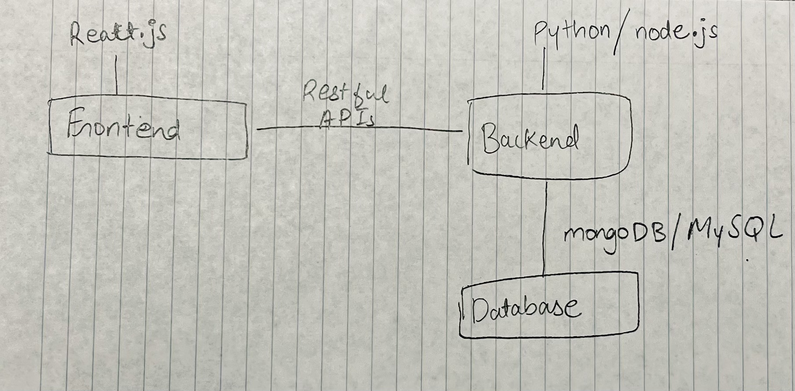

# Curriculum Crafter

## Project Summary

Our project is a web application that assists learners in designing their own customized lesson plans. It creates a plan based on data from previous courses, transfer credits, AP credits, and competency test scores. The app allows users to input their academic objectives and desired courses, and it generates a personalized plan that illustrates the most efficient route to graduation. It takes into account variables such as course prerequisites, graduation requirements, and the potential for early graduation. Students can easily identify their academic route thanks to the user-friendly design, which also helps them track their progress toward their degree and make informed class selections.

## Description of the Application

The application we're developing is designed to simplify and enhance the process of academic planning for students. The primary goal is to help students create a clear, personalized course plan that aligns with their academic history and future goals.

### **What We Want to Do:**

1. Accumulating Academic Data: The app will collect and integrate various pieces of information from a student's academic history and map them to the data from transferology, UIUC AP credits policy, and proficiency exams policies for each department.  
2. User Course Planning: Essentially, the user (students) will provide information in the user input section with specific courses for interest, major, possible minors,  and their expected graduation timeline. Based on this following information, it will generate a course graph highlighting the course path the student can take.
3. Optimize Graduation Path: In addition to the course path that is provided, the web app will provide graduation path suggestions for the most effective way to graduate (could be more or less years than the user initially suggested). The following information will be determined through analyzing course prerequisites, graduation requirements, and possible overlaps in credits, helping the student optimize their time spent in college.  
4. Academic Journey Visualization: The app would provide visual tools, such as interactive timelines and progress charts so that students can view their academic history on a trajectory, to help them understand their journey thus far and make informed decisions about what courses they’re planning to register for.

**Problem We Want to Solve:**

Students often face challenges in planning their course schedules, especially when juggling various credits and requirements. This app aims to address this issue by providing a comprehensive, user-friendly tool that takes the guesswork out of academic planning. It will streamline the process, reduce confusion, and help students stay on track towards their academic goals, ultimately making their educational experience more efficient and less stressful.

## Good creative component

We are planning on making an interactive academic map visualization for the creative component. This feature would provide a dynamic visual representation of a student’s entire academic journey, courses they’re currently taking, courses already taken and future courses. Each course would be seen as a node on the map, connected to related courses through prerequisites and corequisites. This would allow students to easily navigate their academic plan and understand the relationships between different courses.

We will also have the map offer real-time updates as students adjust their course plans or enter new information. The map would automatically update to reflect any changes made, including how they impact graduation timelines and prerequisites.

## Realness

The project will leverage a variety of datasets in order to obtain data for comprehensive academic and college course planning. The primary dataset will include AP course credit, Course explorer, and the proficiency test from several different UIUC related web pages. These sources provide data regarding course prerequisites, credits, and course descriptions, which will then be formatted into a csv file format. The expected data size will be all of the courses offered at UIUC (course explorer), the list of AP courses (AP credit page), and list of proficiency exams (proficiency exam page).  
In addition, for the transfer course support, we will also be sending requests to transferology given the user’s provided transfer courses. The transferology platform will help with identifying transfer possibilities for certain courses from other institutions. This external dataset will be accessed via API requests, and will add to the internal UIUC data to provide a holistic view of each student's academic progress, especially for transfer students. These following datasets ensure that all of the student’s academic progress and future academic goals are taken into account while developing a comprehensive course map.

## Usefulness

Every student encounters stress every semester as they try to figure out what to register for and how to plan their degree. And by creating this web tool, we hoped to expedite that process and provide better visualization so that students could complete the prerequisites on time and avoid a stressful and heavy semester with difficult classes. We are attempting to provide options such as adding minors or socializing courses. The course department provides a course map, but it is generalized for all students in that major and does not account for minors, whereas our online app is tailored and offers to graduate in an efficient timeline while completing the degree requirement.

## Data Sources

The data sources for this project include the Course Explorer and the AP Exam Score Conversion website, which helps students understand how their AP exam scores translate into university course credits. By utilizing these sources, the application assists learners in designing customized course scheduling tailored to their academic backgrounds. The tool allows users to input their academic objectives, transfer credits, AP scores, and competency test results to generate a personalized plan that highlights the most efficient route to graduation. It considers critical factors like course prerequisites, graduation requirements, and the potential for early graduation, offering a comprehensive and optimized academic path.

The API score conversions would let the initial setup be easier as it can see what courses the student got done with. This would make the filtration of courses much more robust in the required to take vs already taken phase of the course filtration process. The next step in the process is using the courses from the course explorer. What this does is map the type of course to the needs and interests of the student and create a sequence of courses that the student might consider taking.

## Detailed description of functionality

This app helps students efficiently plan their course schedules based on their academic history and goals. Users can create, update, and manage their course plans by entering desired courses and reviewing their academic history. The platform visualizes course prerequisites and sequences on an interactive map. This helps students understand how their choices fit into their overall academic plan and make informed decisions about their path to graduation.

The UI will include a dashboard for progress tracking, a course planner for managing course selections, and a search bar for finding relevant courses. The project work will be divided among team members, with responsibilities for frontend development, backend systems, and project management. This structured approach will ensure the application’s effective functionality and integration.

## Work Distribution

1. Kundan Mergu: Frontend Development, UI/UX Design, Data Visualization
2. Vashishth Goswami: Backend Development, Data Integration, API Requests
3. Karthik Bagavathy: Data Collection, Data Cleaning, Data Analysis
4. Harshita Thota: Project Management, Documentation, Testing, Product Design

**Data Source links:**

* [2024 Advanced Placement Program](https://citl.illinois.edu/citl-101/measurement-evaluation/placement-proficiency/cutoffs-2024-2025/2024-advanced-placement-program)  
* [Departmental Proficiency Exams](https://citl.illinois.edu/citl-101/measurement-evaluation/placement-proficiency/proficiency-testing/subjects-with-proficiency-exams)  
* [Transferology](https://www.transferology.com/index.htm)  
* [Course Explorer](https://courses.illinois.edu/)
