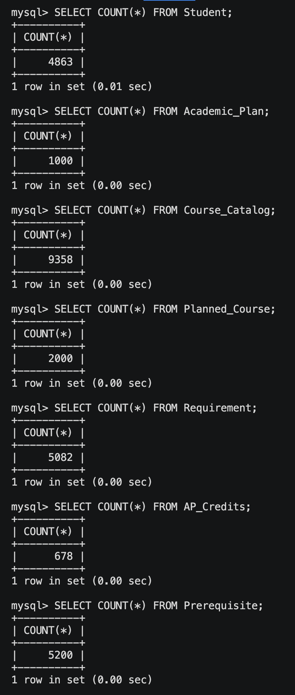
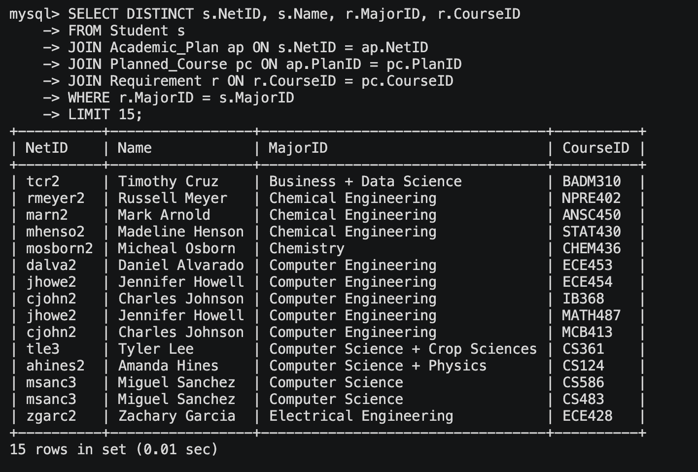
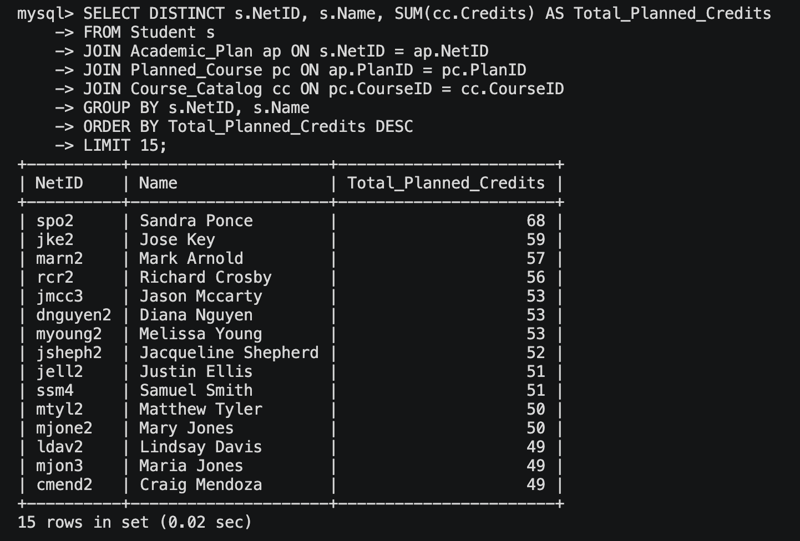
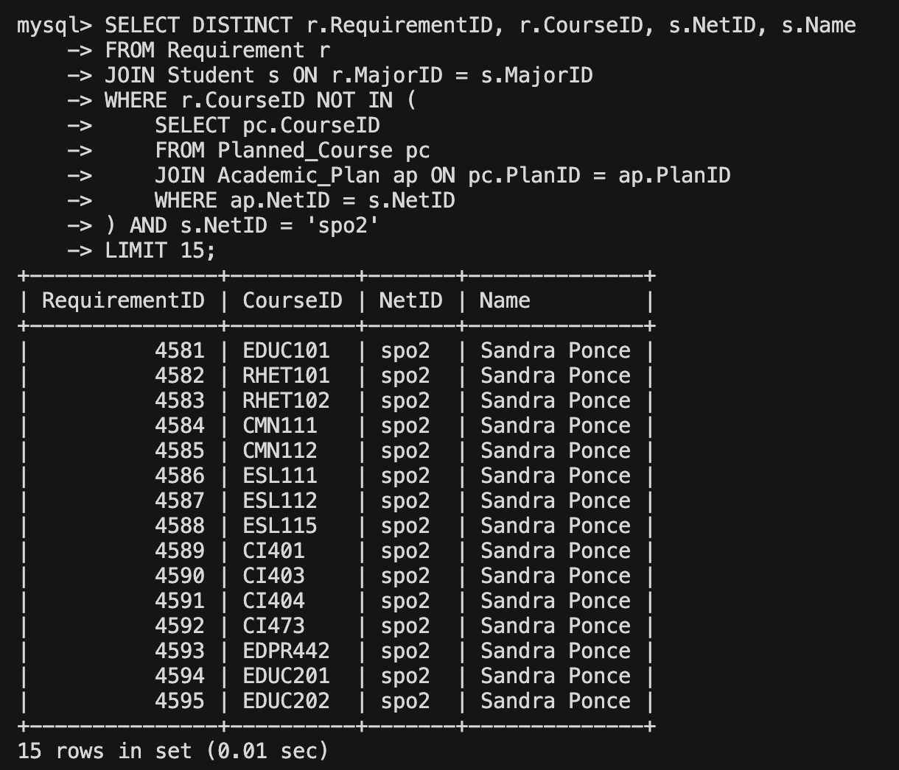
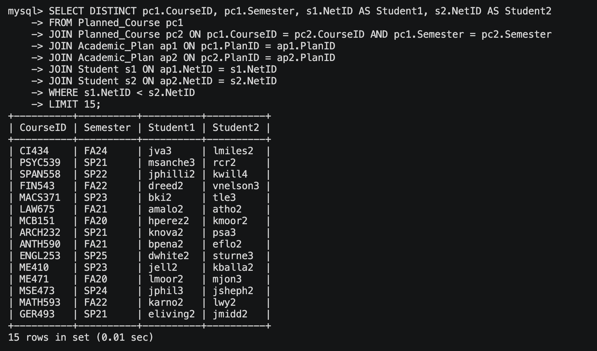
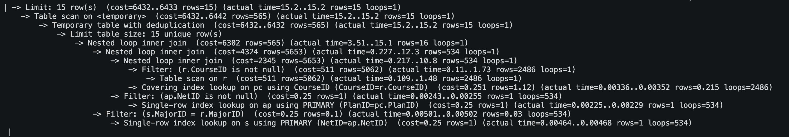
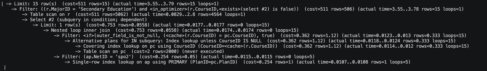
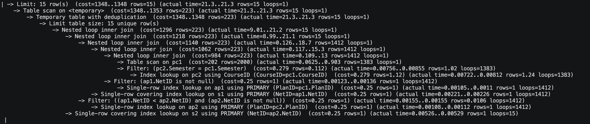

# Stage 3: Database implementation

## Database schema

The database schema is defined in the file `schema.sql`. And we are using `sqlite3` to implement the database.
We will create the database by reading the schema and import the data from the CSV files.
Sqlite3 commands are as follows:

```bash
vashishth@Frickie-Pro doc % sqlite3 db.db
SQLite version 3.43.2 2023-10-10 13:08:14
Enter ".help" for usage hints.
sqlite> .read schema.sql
sqlite> .mode csv
sqlite> .headers on
sqlite> .import Student.csv Student
sqlite> .import Academic_Plan.csv Academic_Plan
sqlite> .import Course_Catalog.csv Course_Catalog
sqlite> .import Planned_Course.csv Planned_Course
sqlite> .import Requirement.csv Requirement
sqlite> .import AP_Credits.csv AP_Credits
sqlite> .import Prerequisite.csv Prerequisite
```

And then I made a dump sql file for mysql by using the following command:

```bash
sqlite3 db.db .dump > sqlite_dump.sql
```

We were having issues with sqlite and so we migrated the database to mysql. So that we can run mysql by using the following command:

```bash
mysql -u root -p curriculum < sqlite_dump.sql
```

## Count of rows in each table



## Queries

### Query 1: Find Students Who Have Planned Courses That Fulfill a Requirement

```sql
SELECT DISTINCT s.NetID, s.Name, r.MajorID, r.CourseID
FROM Student s
JOIN Academic_Plan ap ON s.NetID = ap.NetID
JOIN Planned_Course pc ON ap.PlanID = pc.PlanID
JOIN Requirement r ON r.CourseID = pc.CourseID
WHERE r.MajorID = s.MajorID
LIMIT 15;
```



### Query 2: Find Total Credits Planned by Each Student

```sql
SELECT DISTINCT s.NetID, s.Name, SUM(cc.Credits) AS Total_Planned_Credits
FROM Student s
JOIN Academic_Plan ap ON s.NetID = ap.NetID
JOIN Planned_Course pc ON ap.PlanID = pc.PlanID
JOIN Course_Catalog cc ON pc.CourseID = cc.CourseID
GROUP BY s.NetID, s.Name
ORDER BY Total_Planned_Credits DESC
LIMIT 15;
```



### Query 3: Find Requirements Not Yet Planned by Student with NetID = 'spo2'

```sql
SELECT DISTINCT r.RequirementID, r.CourseID, s.NetID, s.Name
FROM Requirement r
JOIN Student s ON r.MajorID = s.MajorID
WHERE r.CourseID NOT IN (
    SELECT pc.CourseID
    FROM Planned_Course pc
    JOIN Academic_Plan ap ON pc.PlanID = ap.PlanID
    WHERE ap.NetID = s.NetID
) AND s.NetID = 'spo2'
LIMIT 15;
```



### Query 4: Find Students Taking the Same Class in the Same Semester

```sql
SELECT DISTINCT pc1.CourseID, pc1.Semester, s1.NetID AS Student1, s2.NetID AS Student2
FROM Planned_Course pc1
JOIN Planned_Course pc2 ON pc1.CourseID = pc2.CourseID AND pc1.Semester = pc2.Semester
JOIN Academic_Plan ap1 ON pc1.PlanID = ap1.PlanID
JOIN Academic_Plan ap2 ON pc2.PlanID = ap2.PlanID
JOIN Student s1 ON ap1.NetID = s1.NetID
JOIN Student s2 ON ap2.NetID = s2.NetID
WHERE s1.NetID < s2.NetID
LIMIT 15;
```



## Indexing

### For query 1

```sql
EXPLAIN ANALYZE
SELECT DISTINCT s.NetID, s.Name, r.MajorID, r.CourseID
FROM Student s
JOIN Academic_Plan ap ON s.NetID = ap.NetID
JOIN Planned_Course pc ON ap.PlanID = pc.PlanID
JOIN Requirement r ON r.CourseID = pc.CourseID
WHERE r.MajorID = s.MajorID
LIMIT 15;
```



```sql
**Recommended Indexes:**
1. CREATE INDEX idx_requirement_majorid ON Requirement (MajorID);
2. CREATE INDEX idx_student_majorid ON Student (MajorID);
-- 3. CREATE INDEX idx_planned_course_semester ON Planned_Course (Semester);
```

### For query 2

```sql
EXPLAIN ANALYZE
SELECT DISTINCT s.NetID, s.Name, SUM(cc.Credits) AS Total_Planned_Credits
FROM Student s
JOIN Academic_Plan ap ON s.NetID = ap.NetID
JOIN Planned_Course pc ON ap.PlanID = pc.PlanID
JOIN Course_Catalog cc ON pc.CourseID = cc.CourseID
GROUP BY s.NetID, s.Name
ORDER BY Total_Planned_Credits DESC
LIMIT 15;
```


```sql
**Recommended Indexes:**
```

### For query 3

```sql
EXPLAIN ANALYZE
SELECT DISTINCT r.RequirementID, r.CourseID, s.NetID, s.Name
FROM Requirement r
JOIN Student s ON r.MajorID = s.MajorID
WHERE r.CourseID NOT IN (
    SELECT pc.CourseID
    FROM Planned_Course pc
    JOIN Academic_Plan ap ON pc.PlanID = ap.PlanID
    WHERE ap.NetID = s.NetID
) AND s.NetID = 'spo2'
LIMIT 15;
```



```sql
**Recommended Indexes:**
1. CREATE INDEX idx_course_catalog_courseID ON Course_Catalog(CourseID);
3. CREATE INDEX idx_planned_course_semester ON Planned_Course (Semester);
```

### For query 4

```sql
EXPLAIN ANALYZE
SELECT DISTINCT pc1.CourseID, pc1.Semester, s1.NetID AS Student1, s2.NetID AS Student2
FROM Planned_Course pc1
JOIN Planned_Course pc2 ON pc1.CourseID = pc2.CourseID AND pc1.Semester = pc2.Semester
JOIN Academic_Plan ap1 ON pc1.PlanID = ap1.PlanID
JOIN Academic_Plan ap2 ON pc2.PlanID = ap2.PlanID
JOIN Student s1 ON ap1.NetID = s1.NetID
JOIN Student s2 ON ap2.NetID = s2.NetID
WHERE s1.NetID < s2.NetID
LIMIT 15;
```



```sql
**Recommended Indexes:**
-- 1. CREATE INDEX idx_planned_course_semester ON Planned_Course (Semester);
-- 2. CREATE INDEX idx_academic_plan_creationdate ON Academic_Plan (CreationDate);
-- 3. CREATE INDEX idx_student_name ON Student (Name);
```

## Conclusion

Looking at the previous 4 advanced queries, and their results along with the cost analysis, the indices that best represent and can access the attributes in the database to the fullest are 'idx_student_majorid' ON Student (MajorID) from the first query, and idx_course_catalog_courseID ON Course_Catalog(CourseID) from the thrid query. This is because the operations performed on them take way less time and are almost comparable to the Primary keys of the academic plan table and any other primary key that computes and accesses attributes pretty fast. Apart from taking much less time in computation, these indices also are structured in a way so that they can access every attribute in any given table.
